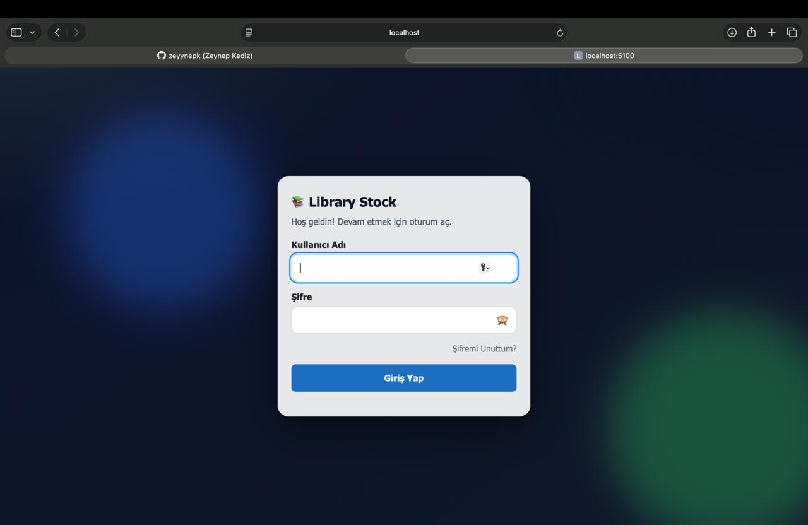

# 📚 LibraryStock

LibraryStock is a web application built with ASP.NET Core (.NET 8) and Blazor Server  
It is designed to manage library and stock operations using role-based authorization

The system centralizes user management, stock tracking, order creation, and order approval  
It is suitable for small to medium-sized organizations


## 🎯 Project Purpose

This project was developed to

- Manage stock operations efficiently
- Control user access based on roles
- Make order processes more secure and traceable

## 🧩 Features

### 🔐 Role-Based Authorization
- Admin
- Staff

### 👤 User Management (Admin Only)
- Add users
- Update users
- Delete users
- Assign roles

### 📦 Stock Management
- View stock items
- Add items to stock
- Reduce stock
- Track critical stock levels

### 📝 Order Management
- Create orders
- Approve orders (Admin only)
- Block non-critical orders until critical items are ordered

### 📧 Email-Based Password Reset
- Verification code sent via SMTP
- Secure password reset flow

## 🧱 Technologies Used

- ASP.NET Core (.NET 8)
- Blazor Server
- Entity Framework Core
- SQL Server
- HTML / CSS
- Bootstrap

## 📋 Requirements

To run this project, the following are required

- .NET SDK 8.0
- SQL Server (LocalDB or SQL Server Express)
- SMTP-enabled email account
- Gmail App Password or similar
- macOS, Windows, or Linux

## 📦 Libraries & Packages

Main libraries used

- Microsoft.EntityFrameworkCore
- Microsoft.EntityFrameworkCore.SqlServer
- Microsoft.EntityFrameworkCore.Tools
- Microsoft.AspNetCore.Components
- System.Net.Mail

Other dependencies are part of the standard .NET ecosystem


## ⚙️ Installation

### 1. Clone the repository

```bash
git clone https://github.com/zeyynepk/LibraryStock.git
```

### 2. Navigate to the project directory

```bash
cd LibraryStock.App.Clean
```

### 3. Configure appsettings.Development.json

- Database connection string
- SMTP email settings

### 4. Run the application

```bash
dotnet run
```

### 5. Open in your browser

```text
http://localhost:5100
```

## 🔐 Security Notes

- Database credentials must not be committed to GitHub
- SMTP passwords must not be committed to GitHub
- appsettings.Development.json is excluded via .gitignore
- Sample values are provided in appsettings.json

  
## 📂 Project Structure

- Components/ → UI components and pages
- Services/ → Business logic (Auth Stock Orders Users)
- Models/ → Database models
- Data/ → DbContext and EF Core configuration



## 👩‍💻 Developer

Zeynep Kediz  
Computer Engineering Student  
